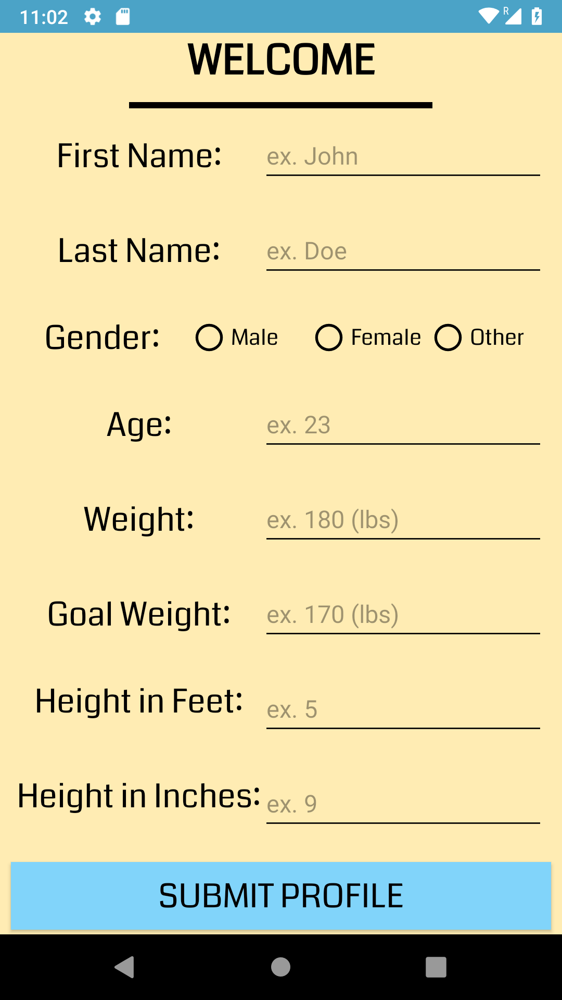
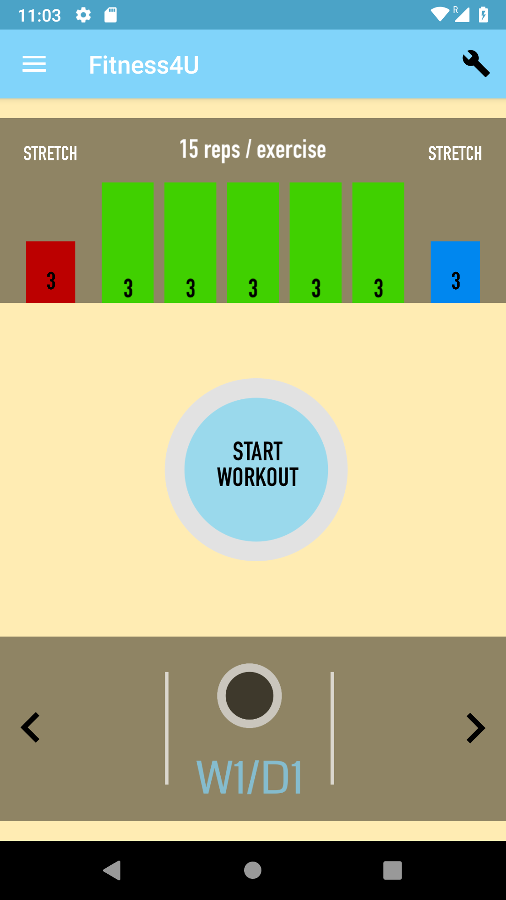
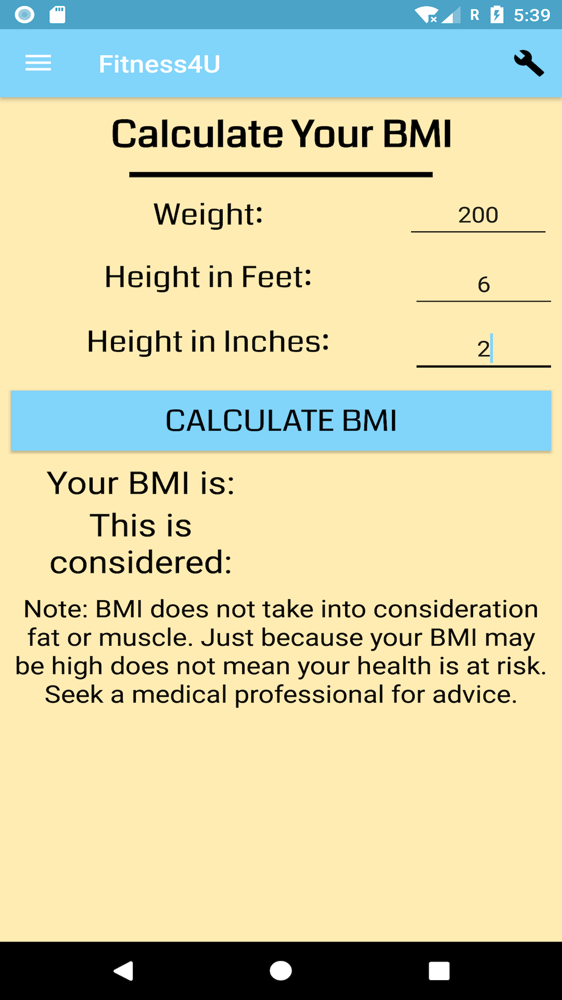
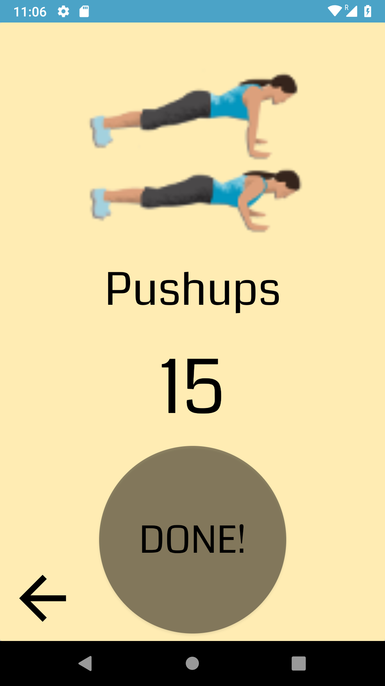

# Fitness4You

  

Your next step to living a better healthier you!
Fitness4You is all about testing your body against yourself! Workout from your home, the gym, or outside!
All you need is yourself, 30 minutes and a positive attitude!

Choose the workouts you want to include in your workout regime, start your first workout, and never look back again!
Workouts are one month long three times a week and get progressively harder.

Create, read, update, delete and share your workouts with your fellow friends for bragging rights.

Calculate your Body Mass Index (BMI)in-app to track your overall health and potential risks.

## Getting Started

Clone or download the project and you're on your way to victory!

## Prerequisites

Fitness4You requires that you have a minimum SDK of 24 or higher.

## Features

### 1. Build Your Profile

  

### 2. Complete & Check Your Workouts

  

### 3. Calculate Your BMI

  

### 4. Don't Forget... Workout!

  

## Compatibility

Fitness4You is compatiable for all Android phones and tablets of all sizes.

## Acknowledgments:

 1. [Picasso](https://github.com/square/picasso) 
 2. [Volley](https://github.com/google/volley)
 3. [AboutLibraries](https://github.com/mikepenz/AboutLibraries)
 4. [BMI Calculator API](https://rapidapi.com/navii/api/bmi-calculator)
 
 
 ## Contributor:
- [Chris Dias](https://github.com/chrisdias96)

:copyright: 2018 Chris Dias, All rights reserved.
